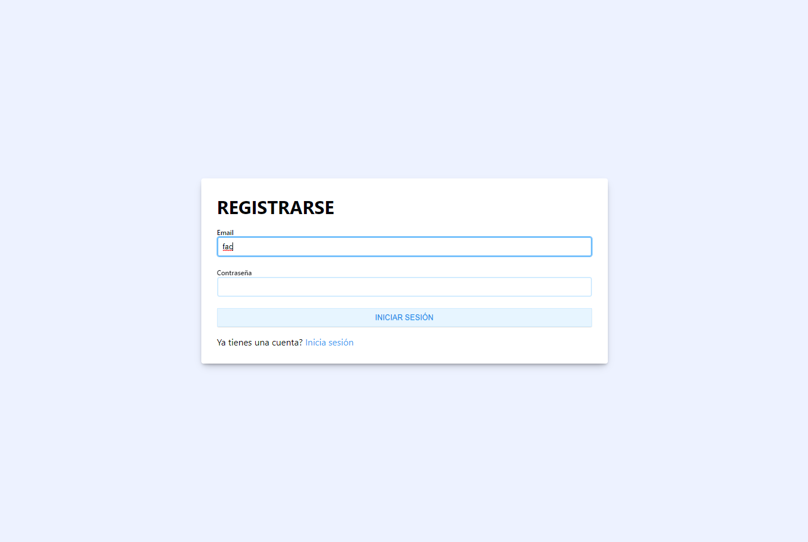
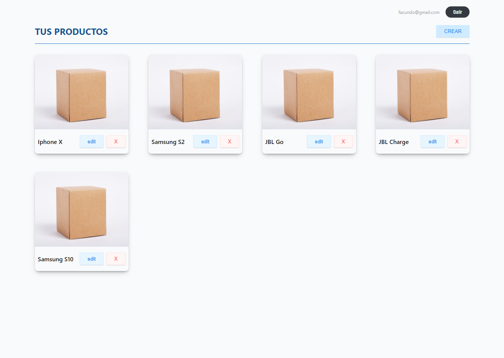
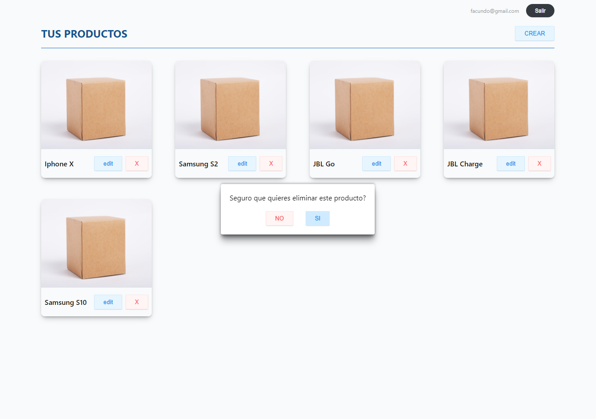
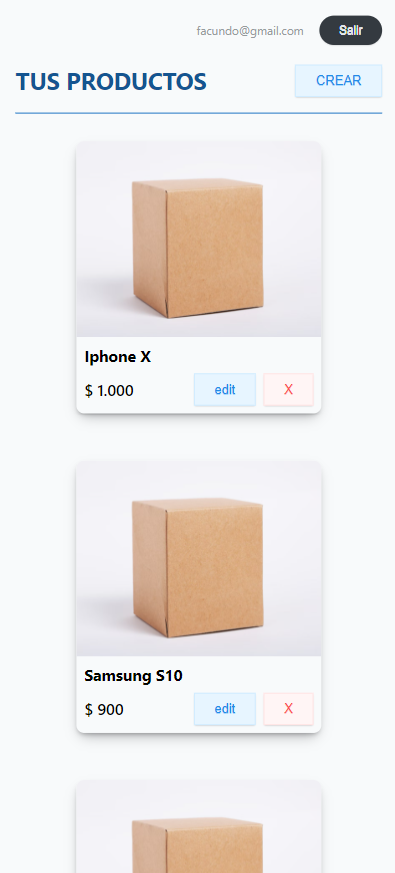
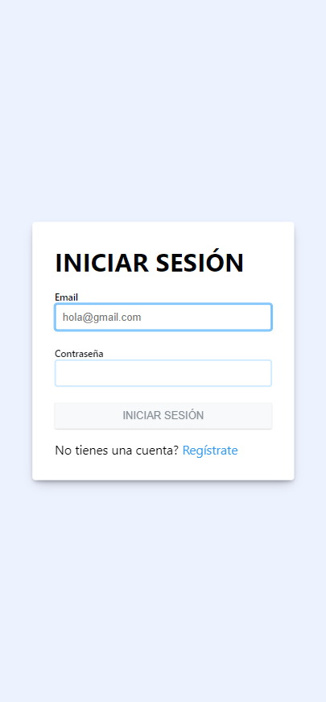

# Addin Technologies Challenge

## Descripción

Challenge desarrollado para la empresa Addin Technologies. Consiste en un SPA donde pueda registrarse e iniciar sesión con JWT, y una lista privada de productos que puedan modificarse y borrarse.

## Tecnologías usadas

- MongoDB, Mongoose
- Node
- JWT
- Express
- React
- Axios
- React Router
- Open Props

## Presentación y funcionalidades

### Login y Register

Pantalla para registrarse o logearse a la aplicación. Maneja los errores en caso de que el email ya esté asociado a una cuenta o de que el email o la contraseña sean incorrectas.

### Lista de Productos

Pantalla principal de la App. Muestra quien esta logeado, opción para deslogearse y la lista de los prodcutos de ese usuario, donde los puede editar y eliminar.

### Responsive

La aplicación es completamente responsive.
